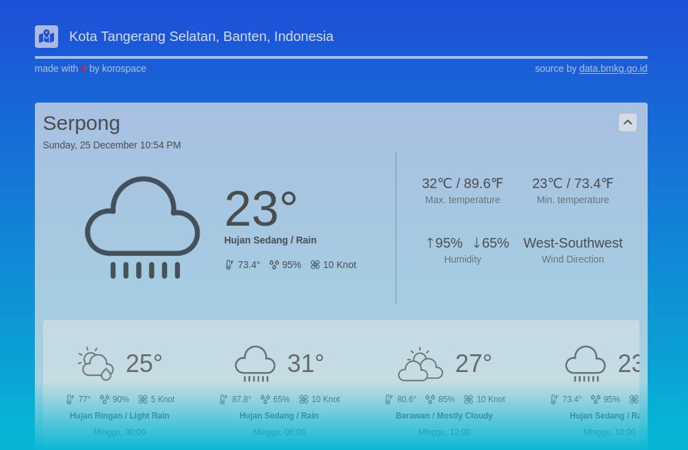

  <h1 align="center">
    Indonesia Weather Forecast  
  </h1>

  live demo here <a href='https://cuacaidn.web.app'>https://cuacaidn.web.app</a>

## Stack
- [x] VueJs 3
- [x] Tailwind 3

## Setup
 1. git clone `https://github.com/korospace/cuaca-idn.git`
 2. npm install
 3. npm run serve

## Preview

